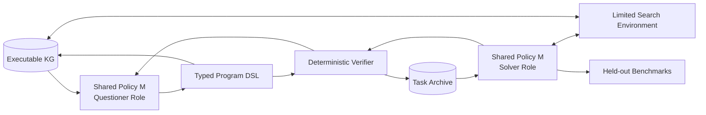

# GraphTask-R1：面向图搜索 Agent 的可验证任务自进化项目执行计划

> **项目代号（暂定）**：GraphTask-R1  
> **论文题目候选**：*Learning to Challenge Graph Agents: Verifiable Task Evolution for Knowledge-Graph Reasoning*  
> **文档用途**：研究方案定稿、工程规格、实验协议，以及后续交给 Codex 的实现依据。  
> **版本**：v1.1，2026-08-04（首版调整为单模型共享策略 self-play）  

---

## 0. 最终决策

### 0.1 是否值得做

**值得做，但不能再把论文定义为“VisPlay + Graph-R1”。**

截至 2026 年 8 月，下面几条相关路线已经出现：

- VisPlay：Questioner 与 Reasoner 交替训练，用当前 Reasoner 的不确定性寻找能力边界问题；
- SPICE：从文档中生成问题，并用约 50% 通过率作为 frontier curriculum；
- SPARK：已经把知识图谱路径、Proposer–Solver 自博弈和 KG 验证奖励结合起来；
- Graph-R1：训练 Agent 在图环境中进行多轮检索和推理；
- Search-on-Graph-R1：在 Freebase 上使用 Search 工具，通过 SFT 冷启动和 GRPO 训练紧凑的图搜索模型；
- GraphWalker：使用受约束随机游走生成合成图轨迹，再进行分阶段 SFT 和轻量 RL；
- Dynamic-KGQA / KGQAGen：已经研究了从图中自动生成可执行、可验证的 QA 数据。

因此，以下版本缺乏足够创新性：

```text
随机采样一条 KG 路径
→ LLM 把路径改写成问题
→ Solver 回答
→ Solver 答错则奖励 Questioner
```

本项目应转化为下面的研究问题：

> **能否训练一个具有图工具访问权限的 Challenger，主动构造带可执行程序证书的推理任务；通过反事实图干预验证任务确实依赖所声明的图结构；再用这些位于 Solver 能力边界附近的任务，持续提升一个真实图搜索 Agent 的泛化能力？**

### 0.2 最终方法主线

项目核心不是“生成更难的问题”，而是生成满足四个条件的训练任务：

1. **Executable**：答案可由确定性的图查询程序执行得到；
2. **Faithful**：自然语言问题与程序、答案和证据子图一致；
3. **Structurally necessary**：去除关键关系、条件或证据后，答案发生可测变化；
4. **Solver-adaptive**：难度落在当前 Solver 的学习边界，而不是过易、不可解或纯语言刁难。

### 0.3 第一版的范围

第一版采用**原生、可执行知识图谱**，而不是先从文档自动构图：

- 开发和冷启动：KQA Pro 的小型可执行 KB；
- 主实验：Freebase；
- 主评测：WebQSP、ComplexWebQuestions、GrailQA；
- 可选扩展：Graph-R1 风格的文档超图。

这样做的原因是：论文最关键的新变量是“任务自进化是否有效”。如果第一版同时引入文档解析、关系抽取和图噪声，失败时无法区分是生成器问题、图质量问题还是搜索 Agent 问题。

### 0.4 预期论文贡献

最终论文应围绕以下四点展开，而不是围绕模块数量展开：

1. **Active graph task discovery**：Challenger 主动构造图查询程序，而非随机路径采样；
2. **Counterfactual structural verification**：通过程序级和图级干预验证每个条件是否真正必要；
3. **Adaptive self-play curriculum for a tool-using Solver**：Questioner 针对当前图搜索 Agent 的能力边界生成任务；
4. **Program-certified cold start**：从生成程序自动编译 Solver 的工具调用轨迹，减少对人工 gold SPARQL 轨迹的依赖。

以上是“待实验验证的贡献主张”，在实验完成前不要使用“首次”“显著优于”等措辞。

---

## 1. 项目总览

### 1.1 一句话方法

**GraphTask-R1 使用同一个共享参数的小型语言模型，通过角色条件分别充当 Questioner 与 Solver：Questioner 在特权图环境中生成“问题—答案—可执行程序—最小证据”任务证书，Solver 在受限 Search 环境中回答；确定性验证器提供奖励，两种角色的经验共同更新同一策略，从而形成真正的 self-play 共进化。**

### 1.2 系统流程



### 1.3 角色与信息不对称

#### Challenger

可见：

- 局部图结构；
- 实体、关系和类型标签；
- 可执行程序及其执行结果；
- 当前 Solver 的能力统计；
- 历史任务档案中的覆盖率和失败模式。

不可见：

- benchmark 测试问题原文；
- 测试集逻辑形式；
- Solver 当前 rollout 的隐藏推理内容。

#### Solver

可见：

- 自然语言问题；
- 已完成实体链接的 topic entities；
- 有限的 `search` / `inspect` 工具；
- 每一步工具返回的真实图事实。

不可见：

- Challenger 的 gold program；
- gold SPARQL；
- gold supporting subgraph；
- gold answer，直到奖励计算。

#### Verifier

Verifier 不是第三个自由生成的 Agent，而是以确定性程序为主的质量门控系统：

- 程序编译与执行；
- 答案集合验证；
- 图干预；
- 最短捷径检测；
- 结构与文本去重；
- 答案泄漏检测；
- 可选的冻结语义解析器。

### 1.4 研究假设

- **H1：** 主动程序构造比随机路径采样产生更高比例的有效复杂任务；
- **H2：** 反事实结构必要性过滤能减少“看似多跳、实际可单跳或靠先验回答”的伪多跳问题；
- **H3：** 基于 Solver frontier 的自适应课程，比固定 hop curriculum 或静态合成数据更能提升 held-out KGQA；
- **H4：** 带程序证书的合成任务可以自动生成可靠的图工具冷启动轨迹，从而减少对人工 gold SPARQL 轨迹的依赖。

---

## 1.5 第一版固定实现：Single-Policy Self-Play

### 1.5.1 模型设定

第一版选用一个可本地训练的 **3B–4B decoder-only instruct model**。配置项允许替换具体 checkpoint，但首轮只使用一个模型实例：

```yaml
model:
  policy_name_or_path: <3B-4B-instruct-checkpoint>
  parameter_sharing: full
  tuning: lora
  lora_rank: 32
  roles: [questioner, solver]
```

“同一个模型”在本项目中严格表示：

```text
Questioner policy πQ = πθ(y | role=questioner, privileged graph state)
Solver policy     πS = πθ(y | role=solver, limited search state)
```

两者共享同一参数 θ，差别只来自角色提示、可见状态、工具集合和输出格式。

### 1.5.2 为什么不使用两个独立 LoRA

首版研究问题就是：一个模型能否通过扮演任务提出者和任务求解者形成内生课程。因此独立 adapter 会弱化这一命题。共享参数还具有以下优势：

- Questioner 学到的图结构和程序知识可迁移给 Solver；
- Solver 的失败模式可直接改变 Questioner 的内部表示；
- 参数量和显存更低，适合快速验证；
- 更接近 VisPlay 式单模型多角色 self-play。

主要风险是梯度冲突和角色串通，因此必须保留 opponent snapshot、独立角色提示、外部 verifier 和跨模型评测。

### 1.5.3 每轮训练协议

每轮分为四步，但只更新一次共享参数：

```text
1. Questioner rollout：当前策略生成任务证书
2. Opponent evaluation：冻结快照以 Solver 角色回答，产生 frontier signal
3. Solver rollout：当前策略在新任务 + archive + 基础任务上搜索回答
4. Joint update：分别计算两种角色优势，归一化后联合更新同一 θ
```

推荐首轮采样比例：

```yaml
self_play:
  questioner_groups_per_round: 64
  solver_episodes_per_round: 256
  questioner_loss_weight: 0.35
  solver_loss_weight: 0.65
  opponent_snapshot_lag: 1
  archive_ratio: 0.35
  base_task_ratio: 0.35
  new_task_ratio: 0.30
```

该比例不是论文结论，只是工程初值。需要记录每个角色的梯度范数和余弦相似度；若长期负相关，可加入 PCGrad 或按角色交替 optimizer step，但仍保持同一参数集合。

### 1.5.4 第一版最小 operator 范围

为保证 self-play 能快速跑通，第一版只实现：

- `Entity`
- `Hop`
- `Intersect`
- `FilterType`

暂缓 Count、比较、数值和时间操作。第一版的创新验证重点是共进化机制和结构必要性，而不是 DSL 覆盖率。

### 1.5.5 第一版成功标准

至少同时满足：

1. 经过 3–5 个 self-play round，Questioner 有效任务率不下降；
2. 新任务的 Solver 通过率集中向目标 frontier 区间移动；
3. Solver 在 held-out 人工问题上优于相同 token 预算的 static synthetic 训练；
4. 删除关键图证据后，Solver 正确率显著下降；
5. 换用一个未参与训练的外部 Solver，任务仍保持可回答与中等难度；
6. 共享模型没有出现只会出题不会答题，或只会答题不会出题的角色坍缩。


## 2. 与现有工作的边界

| 工作 | 已解决的问题 | 与本项目重合 | 本项目必须提供的差异 |
|---|---|---|---|
| VisPlay | Questioner–Reasoner 交替 GRPO；基于不确定性与多样性产生挑战问题 | 自博弈与冻结对手训练 | 图上答案可执行；难度之外增加结构必要性与图工具 Solver |
| SPICE | 文档 Challenger–Reasoner；50% 通过率 frontier reward | frontier curriculum | 图程序证书、图干预、真实图搜索 Agent |
| SPARK | KG 路径生成问题；Proposer–Solver 自博弈；KG 奖励 | 与朴素想法高度重合 | 主动程序构造而非随机路径；Solver 可访问图工具；反事实必要性而非仅验证边存在 |
| Graph-R1 | 多轮图检索与端到端 GRPO | Solver 交互框架 | 自动发现训练任务，而非只在固定问题上训练 |
| Search-on-Graph-R1 | Freebase Search 工具；SPARQL 脚手架 SFT；GRPO | 主 Solver 基线与工程参考 | 由 Challenger 生成程序及轨迹，不依赖每个样本的人工 gold SPARQL |
| GraphWalker | 随机游走合成问题/轨迹；分阶段 SFT + RL | 静态合成轨迹 | 任务生成策略由 Solver 反馈优化；必要性验证；共进化循环 |
| Dynamic-KGQA / KGQAGen | 动态、可执行、符号验证的 QA 数据生成 | QA 数据生成与验证 | 训练目标是提升图 Agent；任务分布随 Solver 能力变化 |

### 2.1 不应声称的创新

以下都已经有先例，不应作为单独创新点：

- 从 KG 路径生成问题；
- 用 hop 数控制问题难度；
- 用 LLM 把三元组改写为自然语言；
- 使用 GRPO 训练图搜索 Agent；
- 用 50% 通过率寻找能力边界；
- 由同一个基础模型扮演两种角色；
- 用 SPARQL 检查答案是否存在。

### 2.2 可以成立的差异化命题

论文真正需要证明的是：

> 与路径是否存在相比，**“问题是否必须使用该结构”**是更严格、更有训练价值的质量标准；在这个标准下进行 Solver-adaptive task discovery，可以提升独立人工 benchmark 上的图搜索推理，而不仅是在自生成分布上提升。

---

## 3. 问题形式化

### 3.1 图与任务

给定知识图谱：

\[
\mathcal{G}=(\mathcal{E},\mathcal{R},\mathcal{T}),
\]

其中三元组：

\[
(e_s,r,e_o)\in\mathcal{T}.
\]

一个生成任务不是简单的 `(question, answer)`，而是一个可审计证书：

\[
z=(q, E_q, P, A^*, W^*, m),
\]

其中：

- \(q\)：自然语言问题；
- \(E_q\)：topic entity 集合；
- \(P\)：可执行查询程序；
- \(A^*=\mathrm{Exec}(P,\mathcal G)\)：gold answer set；
- \(W^*\)：支持答案的 witness subgraph；
- \(m\)：元数据，包括程序类型、复杂度、生成轮次和验证分数。

### 3.2 为什么用“程序”而不是“路径”

路径只能自然表示简单链式组合：

```text
A --r1--> B --r2--> C
```

复杂 KGQA 还包含：

- 多条件交集；
- 类型过滤；
- 时间或数值约束；
- 计数；
- 比较；
- 最大值、最小值；
- 多实体桥接；
- 集合逻辑。

因此 Challenger 应生成**类型化查询程序 AST**。路径只是 `Hop(Hop(Entity(...)))` 的一个特例。

### 3.3 程序复杂度

定义加权复杂度：

\[
C(P)=\sum_{o\in P} w(o),
\]

而不是简单使用 hop count。建议初始权重：

| 操作 | 权重 |
|---|---:|
| Entity / Find | 0 |
| Hop | 1.0 |
| FilterType | 0.5 |
| FilterLiteral | 1.0 |
| Intersect | 1.5 |
| Union | 1.0 |
| Count | 1.0 |
| ArgMax / ArgMin | 1.5 |
| Compare | 1.5 |

权重只用于采样、分桶和分析；论文中应通过消融说明结果不依赖某组手工权重。

---

## 4. 核心方法

## 4.1 查询程序 DSL

### 4.1.1 V1 支持的操作

| 操作 | 语义 | V1 |
|---|---|---:|
| `Entity(mid)` | topic entity singleton set | 必须 |
| `Hop(input, relation, direction)` | 沿关系扩展 | 必须 |
| `Intersect(inputs)` | 集合交集 | 必须 |
| `FilterType(input, type_id)` | 类型过滤 | 必须 |
| `FilterLiteral(input, relation, op, value)` | 时间、数值、字符串过滤 | 必须 |
| `Count(input)` | 计数 | 必须 |
| `ArgMax(input, relation)` | 属性最大值 | 第二阶段 |
| `ArgMin(input, relation)` | 属性最小值 | 第二阶段 |
| `Union(inputs)` | 集合并 | 第二阶段 |
| `Compare(left, right, relation, op)` | 比较 | 第二阶段 |

V1 首先把 `Hop + Intersect + FilterType + FilterLiteral + Count` 跑通，避免一次性堆叠所有操作。

### 4.1.2 示例 AST

```json
{
  "op": "intersect",
  "inputs": [
    {
      "op": "hop",
      "input": {"op": "entity", "entity_id": "m.seed_a"},
      "relation": "people.person.profession",
      "direction": "out"
    },
    {
      "op": "hop",
      "input": {"op": "entity", "entity_id": "m.seed_b"},
      "relation": "organization.organization.founders",
      "direction": "out"
    }
  ]
}
```

程序必须满足：

- 可序列化；
- 可计算 canonical signature；
- 可编译为 SPARQL；
- 可在内存图和远程图后端获得一致 denotation；
- 可执行原子级干预；
- 可提取 witness facts。

## 4.2 Challenger：主动任务构造

### 4.2.1 Challenger 的动作空间

Challenger 不直接读取整张图后输出一段自由文本，而是通过受约束工具逐步构建程序：

```text
sample_seed(domain?, type?)
inspect_entity(entity_id)
list_relations(entity_ids, direction, filters)
expand(entity_ids, relation, direction, limit)
add_hop(relation, direction)
add_intersection(branch)
add_filter(type/literal)
execute_partial_program()
inspect_answer_stats()
finalize_program()
verbalize_program()
```

环境维护当前 `ProgramState`，并拒绝：

- 类型不兼容的连接；
- 无效 relation；
- 超过最大预算的程序；
- 循环或重复的无效操作；
- 立即产生空集或过大答案集且无法收缩的分支。

### 4.2.2 分阶段实现

为了降低实现风险，Challenger 分三版：

#### V0：静态程序采样器

- 规则或受约束随机采样程序；
- LLM 只负责 verbalization；
- 建立 random-walk / template baseline；
- 验证 DSL、SPARQL、结构必要性和数据管道。

#### V1：Best-of-N 主动选择

- LLM 根据局部 schema 提出 N 个程序候选；
- 确定性 verifier 打分；
- 选择有效且位于 frontier 的候选；
- 暂不更新 Challenger 参数。

#### V2：Challenger GRPO

- 对同一 seed 生成一个 program/question group；
- 使用验证和 Solver 反馈计算组内奖励；
- GRPO 更新 Challenger adapter；
- Solver 在本阶段冻结。

只有 V0 和 V1 已经稳定并证明 task utility 后，才进入 V2。

## 4.3 自然语言生成与语义忠实性

程序可执行不代表问题语义正确。语言化过程必须单独验证。

### 4.3.1 Challenger 输出格式

```xml
<task>
  <question>...</question>
  <topic_entities>[...]</topic_entities>
  <program>...</program>
  <answer_type>entity_set</answer_type>
</task>
```

Gold answer 由程序执行得到，**不允许 Challenger 自己填写答案作为真值**。

### 4.3.2 语义验证层级

按成本从低到高执行：

1. **格式检查**：字段完整、JSON/XML 可解析；
2. **实体覆盖检查**：问题中的实体 mention 与 topic entities 一致；
3. **答案泄漏检查**：问题中不得出现答案及主要 alias；
4. **关系语义检查**：问题是否包含可映射到程序 relation 的关键语义；
5. **round-trip parsing**：冻结解析器把 `q` 还原为程序 \(\hat P\)；
6. **denotation equivalence**：`Exec(P,G)` 与 `Exec(ĤP,G)` 的答案集合一致；
7. **paraphrase consistency**：对问题生成多个释义，回译程序或答案保持一致；
8. **人工盲审**：用于最终质量报告，不进入大规模在线奖励。

主训练回路应尽量避免依赖自由生成的 LLM judge。LLM judge 可用于离线误差分析，但不能成为唯一真值来源。

## 4.4 反事实结构必要性

这是项目最关键的技术模块。

### 4.4.1 原子必要性

设完整程序答案为：

\[
A^*=\mathrm{Exec}(P,\mathcal G).
\]

对程序中每个可干预原子 \(o_j\)，构造干预程序或干预图：

\[
(P^{-j},\mathcal G^{-j}).
\]

计算：

\[
d_j = 1 - J(A^*, A^{-j}),
\]

其中 \(J\) 为答案集合 Jaccard，\(A^{-j}\) 是干预后的答案。

总体必要性：

\[
R_{need}=\frac{1}{M}\sum_{j=1}^{M}d_j.
\]

最低必要性：

\[
R_{min}=\min_j d_j.
\]

建议：

- `R_need` 进入连续奖励；
- `R_min < ε` 时标记为存在冗余条件；
- 对高质量主训练集使用更严格门槛；
- 保留低分样本用于消融，而不是直接删除全部日志。

### 4.4.2 干预类型

#### 程序级干预

- 删除 `FilterType`；
- 删除 `FilterLiteral`；
- 删除某个 `Intersect` 分支；
- 将某一 `Hop` 替换为其输入集合；
- 用 schema-compatible relation 替换 relation；
- 交换方向；
- 替换中间实体约束。

#### 图级干预

- 删除 witness 中某类支持三元组；
- 删除某个中间实体对应的关键边；
- 注入与答案竞争的 distractor path；
- 注入直接 shortcut edge，测试 Solver 是否改变检索行为。

### 4.4.3 有界捷径搜索

仅做 leave-one-out 仍可能漏掉更短的替代路径。对通过基础验证的任务，在局部子图中执行有界程序枚举：

```text
枚举所有 cost < C(P) 的候选程序 P'
若 Exec(P', G) == A*，则记录 shortcut
```

完整全图搜索不可行，因此采用：

- topic entity 周围的限定 hop 子图；
- relation 白名单；
- 程序成本上界；
- canonical signature cache；
- 只对最终入库候选执行。

`shortcut_found=true` 的任务默认不进入主训练集，但可用于研究“存在多条等价证明”的情况。

### 4.4.4 与 path faithfulness 的本质区别

`path faithfulness` 只能说明采样的边存在；本项目验证的是：

> 如果去掉该关系、约束或证据，原答案是否仍成立，以及是否存在成本更低的等价解。

这使“多跳”从表面长度属性变为可干预、可测量的结构依赖属性。

## 4.5 Solver frontier 与课程学习

### 4.5.1 通过率

对每个任务让冻结 Solver 采样 K 条轨迹：

\[
p_s(q)=\frac{1}{K}\sum_{k=1}^{K}\mathbf 1[\mathrm{F1}(\hat A_k,A^*)\ge\delta].
\]

### 4.5.2 Frontier reward

目标不是让 Solver 永远失败，而是让问题位于可学习边界：

\[
R_{front}=\exp\left(-\frac{(p_s-\tau)^2}{2\sigma^2}\right).
\]

默认：

- `τ = 0.5`；
- `σ` 通过 dev set 校准；
- 对不同程序族允许不同目标区间。

### 4.5.3 能力分桶

维护 Solver 的 competence table：

```text
(operator_signature,
 relation_family,
 program_cost_bin,
 answer_cardinality_bin,
 entity_popularity_bin)
    -> success / attempts / EMA pass rate
```

Challenger 优先覆盖：

- 当前成功率中等偏低；
- 历史上可学习而不是长期零成功；
- 训练数据覆盖不足；
- 与 benchmark 结构相关但不重复的问题族。

### 4.5.4 学习进展用于 archive 采样

对于任务桶 \(b\)：

\[
LP_t(b)=|\mathrm{EMAAcc}_t(b)-\mathrm{EMAAcc}_{t-1}(b)|.
\]

archive 采样权重结合：

- 当前 frontier；
- learning progress；
- 新颖性；
- 防遗忘权重。

不要只训练最新一轮任务。

## 4.6 Challenger 奖励

先定义硬门控：

\[
V(z)=I_{format}I_{exec}I_{nonempty}I_{card}I_{type}I_{semantic}.
\]

主奖励：

\[
R_C = V(z)\cdot[
 w_fR_{front}
 +w_nR_{need}
 +w_vR_{novel}
 +w_cR_{coverage}
 +w_lR_{language}
 -w_sR_{shortcut}
 -w_aR_{answerLeak}
 -w_kR_{cost}
].
\]

### 各奖励含义

- `R_front`：Solver 能力边界；
- `R_need`：反事实结构必要性；
- `R_novel`：文本和程序结构新颖性；
- `R_coverage`：稀缺操作、关系和结构覆盖；
- `R_language`：自然、明确、无明显语法错误；
- `R_shortcut`：存在更短等价程序；
- `R_answerLeak`：答案或 alias 出现在问题中；
- `R_cost`：Challenger 图调用、无效程序和过长输出成本。

### 奖励设计原则

1. 可执行性与语义一致性是硬门控，不应与难度简单加权抵消；
2. 不确定性只代表难度信号，不能代表质量；
3. 训练初期提高 validity 权重，后期逐步提高 frontier 和 novelty；
4. 每个 reward component 必须单独记录，禁止只存总分；
5. 在进入 RL 前，用静态候选数据画出各分量分布，防止尺度失衡。

## 4.7 Solver 环境

### 4.7.1 工具接口

V1 Solver 只需要少量、稳定、可批处理的工具：

```python
search(
    entity_ids: list[str],
    direction: Literal["out", "in", "both"],
    relation_ids: list[str] | None = None,
    limit: int = 100,
) -> list[Triple]

inspect_entity(entity_id: str) -> EntityInfo

final_answer(entity_ids_or_literal: list[str] | str)
```

可选第二阶段工具：

```text
search_relations(entity_ids)
filter_candidates(...)
aggregate(...)
```

工具越多，Agent 越容易通过手工 workflow 而不是学习搜索策略，因此 V1 保持最小工具集。

### 4.7.2 交互循环

```text
Question + linked topic entities
→ Think
→ Search
→ Observe triples
→ Update plan
→ Search / inspect
→ Final answer
```

每个 episode 有：

- 最大回合数；
- 最大返回三元组数；
- 最大 token 数；
- 无效调用次数上限；
- 可配置的超额成本惩罚。

### 4.7.3 Solver 奖励

\[
R_S = R_{answer}
+\lambda_eR_{evidence}
+\lambda_fR_{format}
-\lambda_tR_{turn}
-\lambda_iR_{invalid}.
\]

#### `R_answer`

- entity set F1；
- exact set match；
- literal normalization；
- 计数问题数值等价。

#### `R_evidence`

奖励检索到足以支持答案的事实。注意：

- 不强迫复现 Challenger 的唯一 gold path；
- 如果存在另一条合法证明，也应获得奖励；
- 可以计算检索事实与任一最小 witness 的最大覆盖率；
- 初期可只做离线评估，确认稳定后再加入训练奖励。

#### `R_turn`

建议设置 free zone：

```text
前 T_free 次合法调用不惩罚
超过后线性或分段惩罚
```

否则 Solver 可能为追求短轨迹直接猜答案。

## 4.8 程序到 Solver 冷启动轨迹

每个程序天然描述了一个结构化求解过程。实现 `TraceCompiler`：

```text
Program AST
→ dependency ordering
→ topic entity initialization
→ one-hop Search calls
→ intermediate candidate tracking
→ optional distractor branch
→ final answer
```

轨迹分两类：

1. **Canonical trace**：严格按程序依赖顺序生成；
2. **Robust trace**：插入 1–2 个合理但无效的探索，并展示修正过程。

第一阶段只使用 canonical trace；等 Solver 基础工具格式稳定后再加入 robust trace。

该设计的价值是：合成任务不需要另一个大模型根据 gold SPARQL 逐条编写工具轨迹，且轨迹可以被单元测试。

## 4.9 单模型共享策略的 self-play 共进化算法

```text
输入：共享策略 M_θ、冻结对手快照 M_{θ^-}、图 G、任务档案 A

0. 使用程序数据对同一策略做双角色 SFT 冷启动：
   - role=questioner：图状态 → program + question
   - role=solver：question + tool observations → answer

1. 构建初始任务档案 A0。

2. 对 self-play round t = 1 ... T：
   a. 从当前 M_θ 创建冻结快照 M_{θ^-}
   b. M_θ 以 Questioner 角色生成候选任务组
   c. 确定性 verifier 计算 validity、faithfulness、necessity、shortcut、novelty
   d. M_{θ^-} 以 Solver 角色对有效任务做 K 次 rollout，得到 frontier reward
   e. 保存 Questioner trajectories 和分解奖励
   f. M_θ 以 Solver 角色在 base/archive/new 混合任务上 rollout
   g. 计算 answer、evidence、efficiency、unsupported 等 Solver 奖励
   h. Questioner 与 Solver 优势值按角色分别标准化
   i. 以 L = wQ·LQ + wS·LS 联合更新同一参数 θ
   j. 更新 archive、competence table、EMA snapshot 和 held-out 指标

3. 最终 checkpoint 按 held-out 人工 KGQA 选择，而不是按 self-play reward 选择。
```

### 参数共享约束

Questioner 与 Solver 必须共用：

- 同一 tokenizer 和基础 checkpoint；
- 同一组 LoRA 参数或全参数；
- 同一 optimizer 和 scheduler；
- 同一 checkpoint 版本。

两者只允许在以下方面不同：

- role token / system prompt；
- 可见 observation；
- 工具权限；
- 输出 schema；
- reward function。

### 稳定性约束

- 当前 Questioner 始终由冻结快照 Solver 评估，避免同轮追逐；
- 一个 update 可混合两类 trajectories，但必须按角色分别归一化 advantage；
- 初始建议 `wQ=0.35, wS=0.65`，优先保护 Solver 基础能力；
- 保存上一轮与 EMA 共享策略，计算 cross-snapshot 难度；
- 每轮混入 base/archive 任务，防止共享更新导致遗忘；
- 监控两类角色梯度范数与余弦相似度；
- 若梯度长期强冲突，优先使用 PCGrad 或交替 optimizer step，但不能拆成两套参数；
- 使用外部冻结模型和人工 benchmark 检查私人语言协议；
- 任一角色格式有效率连续两轮下降超过阈值时自动 rollback。

## 5. 数据方案

## 5.1 数据分层

### L0：ToyGraph

用途：

- DSL、编译器和干预单元测试；
- 人工可验证的 golden cases；
- CI 中不依赖外部服务。

应覆盖：

- 1–4 hop；
- 交集；
- 多答案；
- 冗余条件；
- 替代路径；
- shortcut；
- 数值和时间 literal；
- 空答案和超大答案集。

### L1：KQA Pro

用途：

- 小规模端到端验证；
- 程序 DSL 映射；
- Challenger verbalization SFT；
- round-trip parser 冷启动；
- 计数、比较、过滤等复杂 operator 覆盖。

### L2：Freebase

用途：

- 主图环境；
- 与近期 agentic KGQA 方法对齐；
- 支持 WebQSP、CWQ、GrailQA。

建议本地部署 Virtuoso，并实现：

- entity label cache；
- type cache；
- relation schema cache；
- CVT flattening；
- query timeout；
- batched SPARQL；
- deterministic result sorting。

### L3：人工 benchmark

- WebQSP：标准 KGQA 对齐；
- CWQ：复杂组合问题；
- GrailQA：IID、compositional、zero-shot 分析；
- 可选 GraphWalkerBench：未见拓扑分析；
- 可选 KGQAGen / Dynamic-KGQA：生成问题泛化分析。

## 5.2 切分与污染控制

至少实现四类隔离：

1. **Text dedup**：生成问题与 test question 的规范化文本和 embedding 相似度；
2. **Program signature split**：测试 AST 组合不出现在合成训练集中；
3. **Entity split**：部分实验使用未见实体；
4. **Relation/composition split**：区分未见单关系与未见关系组合。

训练时只能从 benchmark 的 train split 提取：

- seed entities；
- relation whitelist；
- 程序模板统计；
- verbalization examples。

不得从 dev/test 的逻辑形式反向生成训练任务。

## 5.3 数据质量注意事项

现有 KGQA benchmark 可能包含：

- 不准确或不完整答案；
- 过时事实；
- 歧义问题；
- rigid exact match 的评估偏差。

因此主结论必须同时报告：

- 原 benchmark gold 指标；
- 在当前本地图上重新执行逻辑形式得到的 executable denotation；
- 人工审计子集；
- entity-set F1 与语义归一化结果。

不要把某一个 benchmark 的绝对分数当成唯一判断依据。

## 5.4 统一数据格式

```json
{
  "task_id": "gt_r03_00001234",
  "source": "selfplay_round_3",
  "question": "...",
  "topic_entities": [
    {"id": "m.x", "mention": "...", "label": "..."}
  ],
  "program": {"op": "..."},
  "sparql": "SELECT ...",
  "gold_answers": [
    {"id": "m.y", "label": "...", "type": "entity"}
  ],
  "witness_facts": [
    {"subject": "m.x", "relation": "r", "object": "m.z"}
  ],
  "program_signature": "intersect(hop(...),hop(...))",
  "program_cost": 3.5,
  "operator_tags": ["intersect", "2hop"],
  "verification": {
    "executable": true,
    "semantic_equivalence": true,
    "necessity_mean": 0.83,
    "necessity_min": 0.50,
    "shortcut_found": false,
    "answer_leak": false
  },
  "solver_stats": {
    "checkpoint": "solver_round_2",
    "num_rollouts": 8,
    "pass_rate": 0.5,
    "mean_search_calls": 3.7
  },
  "generation": {
    "challenger_checkpoint": "challenger_round_3",
    "seed": 42,
    "graph_snapshot": "freebase_manifest_hash",
    "config_hash": "..."
  }
}
```

建议使用 Parquet 存放批量数据，JSONL 用于调试和人工抽样。

---

## 6. 工程架构

## 6.1 技术选型

| 层 | 选型 | 原因 |
|---|---|---|
| 语言 | Python 3.11+ | 训练与图工具生态成熟 |
| 配置 | Hydra / OmegaConf | 多实验组合和可复现配置 |
| Schema | Pydantic v2 | 强类型、序列化、验证 |
| 图主后端 | Virtuoso + Freebase | 与主 benchmark 和近期工作对齐 |
| 测试图后端 | In-memory adjacency | CI 快、确定性强 |
| 可选本地图 | Kuzu | 小型开发和交互分析 |
| SFT | Transformers + PEFT + TRL SFTTrainer | LoRA 和标准数据管道 |
| RL | verl | 支持 GRPO、分布式 rollout、复杂 post-training dataflow |
| Rollout | vLLM 或 SGLang | 高吞吐生成与 tool loop |
| 数据 | Parquet + SQLite/DuckDB metadata | 大规模任务与可查询统计 |
| 追踪 | W&B 或 MLflow | reward component、轨迹和 checkpoint 追踪 |
| 测试 | pytest + Hypothesis | 程序与编译器的 property-based testing |

### 6.1.1 不使用 LangGraph 作为训练热路径

原因：

- rollout 需要批量异步执行；
- 环境状态必须可序列化、可重放；
- 工具调用需要低开销；
- RL 框架需要直接控制 episode 和 reward；
- 调试与训练图应分离。

LangGraph 可选用于：

- 单样本 demo；
- 可视化调试；
- 人工检查界面。

核心训练使用纯 Python `EnvState + step(action)`。

## 6.2 推荐仓库结构

```text
graphtask_r1/
├── AGENTS.md
├── README.md
├── pyproject.toml
├── uv.lock
├── Makefile
├── docker-compose.yml
├── configs/
│   ├── graph/
│   │   ├── toy.yaml
│   │   ├── kqapro.yaml
│   │   └── freebase_virtuoso.yaml
│   ├── model/
│   │   ├── smoke_1_5b.yaml
│   │   ├── main_7b.yaml
│   │   └── cross_family_8b.yaml
│   ├── data/
│   │   ├── kqapro.yaml
│   │   ├── webqsp.yaml
│   │   ├── cwq.yaml
│   │   └── grailqa.yaml
│   ├── training/
│   │   ├── challenger_sft.yaml
│   │   ├── solver_sft.yaml
│   │   ├── challenger_grpo.yaml
│   │   ├── solver_grpo.yaml
│   │   └── selfplay.yaml
│   └── experiments/
│       ├── smoke.yaml
│       ├── static_synthetic.yaml
│       ├── adaptive_no_rl.yaml
│       └── full.yaml
├── src/graphtask_r1/
│   ├── cli.py
│   ├── schema/
│   │   ├── entity.py
│   │   ├── program.py
│   │   ├── task.py
│   │   ├── trajectory.py
│   │   └── reward.py
│   ├── graph/
│   │   ├── base.py
│   │   ├── memory.py
│   │   ├── kuzu_backend.py
│   │   ├── virtuoso.py
│   │   ├── cache.py
│   │   ├── labels.py
│   │   └── overlay.py
│   ├── dsl/
│   │   ├── ast.py
│   │   ├── parser.py
│   │   ├── compiler.py
│   │   ├── executor.py
│   │   ├── signatures.py
│   │   ├── cost.py
│   │   └── interventions.py
│   ├── envs/
│   │   ├── base.py
│   │   ├── challenger_env.py
│   │   ├── solver_env.py
│   │   ├── actions.py
│   │   └── tools.py
│   ├── agents/
│   │   ├── challenger.py
│   │   ├── solver.py
│   │   ├── adapters.py
│   │   ├── prompts.py
│   │   └── parsing.py
│   ├── generation/
│   │   ├── program_sampler.py
│   │   ├── verbalizer.py
│   │   ├── candidate_generator.py
│   │   ├── trace_compiler.py
│   │   └── curator.py
│   ├── verification/
│   │   ├── structural.py
│   │   ├── necessity.py
│   │   ├── shortcut.py
│   │   ├── semantic.py
│   │   ├── lexical.py
│   │   ├── diversity.py
│   │   └── pipeline.py
│   ├── rewards/
│   │   ├── challenger.py
│   │   ├── solver.py
│   │   ├── frontier.py
│   │   ├── novelty.py
│   │   └── normalization.py
│   ├── archive/
│   │   ├── store.py
│   │   ├── sampler.py
│   │   ├── competence.py
│   │   └── stats.py
│   ├── training/
│   │   ├── sft.py
│   │   ├── grpo.py
│   │   ├── rollout.py
│   │   ├── selfplay.py
│   │   ├── checkpoints.py
│   │   └── callbacks.py
│   ├── evaluation/
│   │   ├── answer_metrics.py
│   │   ├── generation_metrics.py
│   │   ├── solver_metrics.py
│   │   ├── benchmark.py
│   │   ├── contamination.py
│   │   └── human_export.py
│   └── utils/
│       ├── hashing.py
│       ├── logging.py
│       ├── seeds.py
│       └── io.py
├── scripts/
│   ├── download_data.sh
│   ├── build_freebase.sh
│   ├── build_cache.py
│   ├── generate_static_tasks.py
│   ├── compile_traces.py
│   ├── train_challenger_sft.sh
│   ├── train_solver_sft.sh
│   ├── train_selfplay.sh
│   └── evaluate_all.sh
└── tests/
    ├── fixtures/
    ├── unit/
    ├── property/
    ├── integration/
    └── e2e/
```

## 6.3 核心接口

### 6.3.1 GraphBackend

```python
from typing import Protocol, Sequence

class GraphBackend(Protocol):
    def neighbors(
        self,
        entity_ids: Sequence[str],
        *,
        direction: str,
        relation_ids: Sequence[str] | None = None,
        limit: int = 100,
    ) -> list["Triple"]: ...

    def execute_program(self, program: "Program") -> "AnswerSet": ...

    def execute_sparql(self, sparql: str) -> "AnswerSet": ...

    def entity_info(self, entity_id: str) -> "EntityInfo": ...

    def relation_info(self, relation_id: str) -> "RelationInfo": ...

    def extract_witness(
        self,
        program: "Program",
        answers: "AnswerSet",
    ) -> list["Witness"]: ...

    def with_overlay(self, overlay: "GraphOverlay") -> "GraphBackend": ...
```

### 6.3.2 Environment

```python
class ToolEnvironment(Protocol):
    def reset(self, sample: "EpisodeInput", seed: int) -> "Observation": ...
    def step(self, action: "AgentAction") -> "StepResult": ...
    def snapshot(self) -> dict: ...
    def restore(self, state: dict) -> None: ...
```

必须保证：

- 相同输入、seed 和 action 序列得到相同 observation；
- state 可 JSON 序列化；
- episode 可离线 replay；
- tool error 不导致整个 worker 崩溃；
- 所有图查询都有 timeout 与 trace id。

### 6.3.3 VerifierResult

```python
class VerifierResult(BaseModel):
    passed: bool
    executable: bool
    answer_nonempty: bool
    cardinality_valid: bool
    type_valid: bool
    semantic_equivalent: bool | None
    answer_leak: bool
    shortcut_found: bool | None
    necessity_mean: float
    necessity_min: float
    novelty_structural: float
    novelty_textual: float
    rejection_reasons: list[str]
    component_latency_ms: dict[str, float]
```

## 6.4 配置示例

```yaml
experiment:
  name: full_round_01
  seed: 42

graph:
  backend: virtuoso
  endpoint: ${oc.env:FREEBASE_ENDPOINT}
  timeout_s: 20
  max_neighbors: 100
  cvt_flatten: true
  cache_dir: data/cache/freebase

program:
  max_cost: 4.5
  max_hops: 4
  allowed_ops: [hop, intersect, filter_type, filter_literal, count]
  answer_cardinality:
    min: 1
    max: 20

verification:
  require_executable: true
  require_semantic_roundtrip: false
  necessity_min_threshold: 0.2
  necessity_mean_threshold: 0.5
  bounded_shortcut_search: true
  shortcut_cost_margin: 0.5
  reject_answer_leak: true

challenger:
  candidates_per_seed: 8
  solver_rollouts_per_task: 8
  frontier_target: 0.5
  frontier_sigma: 0.2

solver:
  max_turns: 8
  free_turns: 3
  max_invalid_calls: 2
  max_observation_triples: 100

archive:
  base_ratio: 0.25
  replay_ratio: 0.35
  new_ratio: 0.40
  max_tasks: 1000000
```

## 6.5 命令行规范

```bash
# 环境与图后端
python -m graphtask_r1.cli graph smoke-test --config configs/graph/toy.yaml
python -m graphtask_r1.cli graph validate --config configs/graph/freebase_virtuoso.yaml

# 数据导入
python -m graphtask_r1.cli data import-kqapro
python -m graphtask_r1.cli data import-grailqa

# 程序与任务
python -m graphtask_r1.cli program sample --num 1000
python -m graphtask_r1.cli task verbalize --input programs.parquet
python -m graphtask_r1.cli task verify --input candidates.parquet
python -m graphtask_r1.cli trace compile --input tasks.parquet

# 训练
python -m graphtask_r1.cli train challenger-sft --config ...
python -m graphtask_r1.cli train solver-sft --config ...
python -m graphtask_r1.cli train challenger-grpo --config ...
python -m graphtask_r1.cli train solver-grpo --config ...
python -m graphtask_r1.cli train selfplay --config configs/experiments/full.yaml

# 评估
python -m graphtask_r1.cli eval generation --checkpoint ...
python -m graphtask_r1.cli eval solver --benchmarks webqsp,cwq,grailqa
python -m graphtask_r1.cli eval contamination --tasks ...
```

每条命令必须支持：

- `--dry-run`；
- `--limit N`；
- `--seed`；
- `--resume`；
- `--output-dir`；
- 配置和 git commit 自动写入 manifest。

---

## 7. 训练计划

## P0：仓库与可复现骨架

### 目标

建立不依赖大模型的工程底座。

### 实现项

- `pyproject.toml`、lint、type checking、pre-commit；
- Hydra 配置；
- 统一日志与 manifest；
- Pydantic schemas；
- ToyGraph fixture；
- CI；
- `AGENTS.md`，写明 Codex 的实现规则。

### 验收

- `make test` 在无 GPU、无外网环境通过；
- 相同 seed 生成完全一致的 toy task；
- schema round-trip 无信息损失；
- 所有输出目录包含 config、git hash、依赖 lock hash。

## P1：DSL、编译器与图后端

### 目标

建立可信的可执行任务证书。

### 实现项

- AST discriminated union；
- canonical signature；
- weighted cost；
- SPARQL compiler；
- in-memory executor；
- Virtuoso backend；
- label/type/relation cache；
- CVT flattening；
- witness extraction。

### 验收

- ToyGraph 上 AST executor 与 SPARQL-style executor 完全一致；
- 1000 个随机合法程序无编译崩溃；
- canonical signature 对等价序列稳定；
- 图查询 timeout、重试和缓存均有测试；
- Freebase 随机程序可执行率达到工程目标后再进入下一阶段。

## P2：静态程序生成与确定性 verifier

### 目标

先在没有 RL 的情况下证明可以产生高质量候选。

### 实现项

- 受约束程序采样；
- answer cardinality filter；
- program intervention；
- graph overlay；
- necessity score；
- bounded shortcut search；
- structural novelty；
- lexical leakage；
- task archive V0。

### 验收

- 人工设计的冗余条件样本被识别；
- 人工设计的 shortcut 样本被识别；
- 干预不修改原始图和原始 AST；
- 通过 verifier 的程序均可重复执行；
- 每个 reject 都有结构化 reason code。

## P3：Verbalizer 与语义验证

### 目标

把“正确程序”转换为“正确自然语言问题”。

### 实现项

- 从 KQA Pro / GrailQA 构建 program-to-question SFT 数据；
- relation label normalizer；
- verbalizer SFT；
- frozen round-trip parser；
- denotation-equivalence 检查；
- paraphrase consistency；
- 人工审阅导出页面或 CSV。

### 验收

- 随机抽样任务中，问题与程序一致率达到预设工程阈值；
- 答案 alias 泄漏率接近零；
- round-trip 失败样本可按原因分类；
- 所有原始 generation 和 verifier trace 可追溯。

## P4：Solver 环境与程序轨迹编译

### 目标

跑通 Graph-R1 / SoG-R1 风格的图工具 Agent。

### 实现项

- `SolverEnv.reset/step`；
- Search tool；
- observation truncation；
- answer parser；
- canonical trace compiler；
- SFT dataset serializer；
- answer/evidence/turn metrics；
- base prompted solver baseline。

### 验收

- 程序轨迹在 ToyGraph 上 100% 得到正确答案；
- KQA Pro mini split 的工具轨迹可回放；
- 无效 JSON、超时、空检索和重复调用不会破坏 episode；
- 与直接 SPARQL 答案一致。

## P5：两个角色的 SFT 冷启动

### 目标

获得稳定的 Challenger 和 Solver 初始策略。

### 实现项

- Challenger adapter SFT；
- Solver adapter SFT；
- LoRA 保存与切换；
- checkpoint manifest；
- 1.5B/3B smoke run；
- 7B main run；
- SFT 与 base 对比。

### 验收

- Challenger 格式有效率和程序可执行率显著高于 base prompt；
- Solver 工具格式有效率稳定；
- Solver-SFT 明显优于直接回答和未训练 Search prompting；
- 训练和推理可从 checkpoint 完整恢复。

## P6：共享模型 self-play 最小闭环（第一版核心 Gate）

### 目标

第一版直接跑通 Questioner 与 Solver 共用同一小模型的 self-play 闭环，但只在 ToyGraph/KQA Pro mini 上进行低成本验证。静态 utility 对照仍需保留，用来判断收益究竟来自任务筛选还是参数共进化。

### 实现项

- 每个 seed 生成 N 个候选；
- verifier 打分；
- Solver 多次 rollout；
- 选择 easy、frontier、hard 三组；
- 等数据量训练三个 Solver；
- 比较 held-out KGQA。

### 验收

只有在以下结果成立后扩大图规模和训练轮数：

- frontier 组不是靠歧义或语言噪声变难；
- necessity-filtered 组的 shortcut rate 更低；
- 在相同训练 token 和 rollout 预算下，frontier + necessity 数据至少在主要结构难题分桶上优于随机合成；
- 提升不只存在于自生成验证集。

如果共享策略出现角色坍缩、Questioner 格式退化或 Solver 性能下降，先修正角色采样比例、快照延迟和奖励尺度，不要直接扩大 RL。

## P7：共享策略 GRPO 稳定化与规模扩展

### 目标

让任务生成策略学习主动发现有效 frontier 任务。

### 实现项

- `verl` 共享策略 rollout worker，支持 Questioner/Solver 两种 role batch；
- group generation；
- reward component normalization；
- frozen opponent snapshot service；
- reward hacking dashboard；
- KL、entropy、validity monitoring；
- checkpoint rollback。

### 验收

- 有效任务比例不因 RL 下降；
- frontier pass-rate 分布向目标区间移动；
- 程序与文本多样性不坍缩；
- necessity 不下降；
- 在 held-out solver snapshot 上仍保持难度，排除只攻击单一 checkpoint。

## P8：完整 self-play curriculum 与跨图评测

### 目标

完成闭环并验证外部泛化。

### 实现项

- Questioner/Solver 联合 GRPO；
- answer + efficiency reward；
- archive replay；
- competence table；
- role-specific snapshots；
- outer self-play orchestrator；
- 每轮 benchmark evaluation；
- best checkpoint selection。

### 验收

- Solver 在人工 benchmark 上优于 SFT-only 和 static-synthetic；
- search calls 不恶化或在相同正确率下减少；
- 旧任务性能无明显灾难性下降；
- 生成器未发生语言协议串通；
- 至少一个 compositional/OOD setting 获得稳定增益。

## P9：扩展到文档图

该阶段不属于第一篇论文的必要条件。

只有原生 KG 版本成功后，再把 `GraphBackend` 替换为：

- Graph-R1 式文档超图；
- 节点对应文本块、表格、图像或实体；
- relation 带抽取置信度；
- verifier 加入 source evidence；
- 结构必要性需要考虑图噪声和多证据冗余。

---

## 8. 测试策略

## 8.1 单元测试

必须覆盖：

- 每个 AST operator；
- parser / serializer；
- canonical signature；
- cost；
- SPARQL escaping；
- answer normalization；
- reward 边界值；
- tool action parser；
- archive dedup；
- checkpoint adapter switching。

## 8.2 Property-based tests

使用 Hypothesis 验证：

1. `parse(serialize(P)) == P`；
2. canonicalize 幂等；
3. 相同 seed 的采样一致；
4. intervention 不修改原 AST；
5. in-memory execute 与 compiled execute 的 denotation 一致；
6. reward 不产生 NaN/Inf；
7. 任务顺序不影响 deterministic metrics；
8. graph result 排序稳定。

## 8.3 Golden graph tests

ToyGraph 至少包含以下明确案例：

| Case | 预期 |
|---|---|
| 真正两跳链 | 两条边均必要 |
| 两跳但存在直接边 | shortcut 被检测 |
| 交集一侧冗余 | `necessity_min=0` 或接近 0 |
| 多条等价证明 | gold path 不唯一但答案正确 |
| 删除证据后答案消失 | graph intervention 有效 |
| 问题包含答案 alias | leakage reject |
| 问题歧义导致多答案 | cardinality/semantic reject |
| 工具返回过多三元组 | truncation 保持格式且记录警告 |

## 8.4 集成测试

- 本地 Virtuoso 容器启动；
- 从 AST 到 SPARQL 到 answer；
- task generation 到 verifier；
- trace compilation 到 SolverEnv replay；
- 1 个 batch 的 SFT；
- 1 个 batch 的 GRPO dry run；
- self-play round 的 resume。

## 8.5 故障注入

主动测试：

- SPARQL timeout；
- 图后端断连；
- malformed tool call；
- empty observation；
- worker 重启；
- checkpoint 缺失；
- Parquet 部分损坏；
- reward service 超时；
- Solver 全对或全错导致 GRPO 组内方差为零。

组内 reward 方差为零时必须：

- 跳过更新或采用安全 fallback；
- 记录指标；
- 不允许产生 NaN 梯度。

---

## 9. 实验设计

## 9.1 研究问题

### RQ1：生成任务是否真正有效且自然？

比较有效率、语义忠实、结构必要性、shortcut、自然度和多样性。

### RQ2：主动程序构造是否优于随机路径？

在相同图调用、LLM token 和候选数量下比较任务 yield 与结构覆盖。

### RQ3：反事实必要性是否对应更真实的推理需求？

通过 edge removal、shortcut injection、question-only baseline 和 shuffled graph 测试。

### RQ4：frontier curriculum 是否比 hop curriculum 更有训练价值？

控制训练数据量、token、模型和优化步数，只改变任务选择策略。

### RQ5：自进化是否提升独立人工 KGQA？

主结果必须来自 WebQSP、CWQ、GrailQA，而不是只来自自生成测试集。

### RQ6：提升来自更好的数据还是更多计算？

报告 task generation、Solver rollout、训练 token 和 GPU 预算；做等预算对比。

## 9.2 核心 baseline

### 任务生成 baseline

1. Template 1–3 hop；
2. Random Walk + LLM verbalizer；
3. GraphWalker-style constrained random walk synthetic data；
4. Dynamic-KGQA/KGQAGen-style static adaptive generator；
5. SPICE-style frontier selection，无 necessity；
6. SPARK-style path-conditioned self-play；
7. Active program generator，无 self-play；
8. 完整 GraphTask-R1。

### Solver baseline

1. Base model direct answer；
2. Base model + Search prompting；
3. Solver-SFT，仅人工训练题；
4. SoG-R1-style SFT + GRPO，固定人工题；
5. + Random-walk synthetic；
6. + Static verified synthetic；
7. + Adaptive best-of-N；
8. + Full alternating self-play。

不要求一开始完整复现所有论文。工程上先完成 1、2、3、5、6、7、8；论文定稿前再补最关键的公开代码 baseline。

## 9.3 生成质量指标

### 确定性指标

- executable rate；
- non-empty answer rate；
- answer cardinality validity；
- type validity；
- answer leakage rate；
- necessity mean / min；
- bounded shortcut rate；
- canonical signature diversity；
- relation/operator coverage；
- duplicate rate；
- graph calls per accepted task。

### 语义指标

- round-trip denotation agreement；
- paraphrase consistency；
- human answerability；
- human faithfulness；
- human ambiguity；
- pairwise naturalness preference。

### 难度指标

- current Solver pass@K；
- held-out checkpoint pass@K；
- cross-family Solver pass@K；
- question-only vs graph-tool performance gap；
- performance drop after evidence removal。

## 9.4 Solver 指标

- answer EM；
- entity-set precision / recall / F1；
- Hit@1；
- tool-call valid rate；
- evidence recall；
- search success rate；
- mean / median search calls；
- retrieved triples；
- tokens per correct answer；
- latency；
- invalid action rate；
- operator-level accuracy；
- program-cost bins；
- IID / compositional / zero-shot；
- calibration of stopping behavior。

## 9.5 关键消融

必须做：

1. 无 `R_need`；
2. 无 shortcut detector；
3. frontier reward 改为 hop curriculum；
4. random path 代替 active program construction；
5. closed-book Solver 代替 Search Solver；
6. 无 archive replay；
7. 无 program-derived cold start；
8. 将共享 adapter 改为独立 adapter（用于验证共享参数是否必要）；
9. 同步 joint update 代替 alternating update；
10. answer-only Solver reward；
11. 无 semantic round-trip；
12. 只在当前 Solver 上算难度，不做 held-out snapshot 验证。

## 9.6 公平比较

所有数据方法应控制：

- accepted task 数；
- 训练 token 数；
- optimizer steps；
- Solver rollout 数；
- 图查询数；
- 模型 backbone；
- LoRA rank；
- test-time turn budget。

至少报告两种设置：

1. **Equal-data**：相同任务数；
2. **Equal-compute**：相同生成与训练预算。

## 9.7 人工评价

建议从不同方法、程序族和难度桶中分层抽样 200–300 个问题，盲审以下维度：

- 是否可以从图证据回答；
- 问题是否明确；
- gold answer 是否完整；
- 每个声明条件是否有必要；
- 语言是否自然；
- 两个问题中哪个更适合作为训练题。

至少双人独立标注；报告一致性和分歧解决协议。

## 9.8 统计分析

- benchmark F1 使用 paired bootstrap confidence interval；
- 方法差异使用 paired bootstrap 或 permutation test；
- 人工偏好使用 bootstrap CI；
- necessity 与 edge-removal performance drop 用 Spearman correlation；
- 多轮 self-play 结果报告至少多个随机 seed；
- 不只报告最高 checkpoint，同时报告均值、方差和选择规则。

---

## 10. 主要风险与应对

| 风险 | 表现 | 应对 |
|---|---|---|
| 与 SPARK 重合 | 被评价为简单组合 | 把主动程序、必要性和图工具 Solver 作为核心，并做直接消融 |
| Reward hacking | 问题晦涩、歧义、alias 干扰 | 硬门控、round-trip、标准化 paraphrase、人工审计 |
| 伪多跳 | 路径长但可单跳或靠先验 | bounded shortcut、question-only、graph removal |
| 生成器坍缩 | 重复关系、模板和实体 | 结构+文本 novelty、coverage reward、archive quotas |
| 角色串通 | Challenger 使用私有表达协议 | 独立 adapter、交叉模型评测、paraphrase、人工自然度 |
| Solver 只会猜 | 低 tool usage 但表面正确 | parametric-only baseline、graph ablation、evidence reward |
| 图后端慢 | rollout GPU 等待 SPARQL | cache、批量查询、本地 Virtuoso、异步服务、邻接预索引 |
| benchmark 标签问题 | 分数不稳定或误导 | 可执行 denotation、人工审计、多个 benchmark |
| RL 不稳定 | reward 方差零、格式崩坏 | SFT 冷启动、分阶段上线、reward normalization、rollback |
| 无外部迁移 | 只在合成数据提高 | P6 提前 go/no-go；不通过则不进入大规模 RL |
| 模块过多 | 审稿人认为堆叠 | 论文只强调三个机制；其他模块作为工程保障 |

---

## 11. Go / No-Go 标准

这些是工程决策阈值，不是最终论文结果承诺。

## Gate A：证书系统可信

必须满足：

- ToyGraph 所有 golden cases 通过；
- 程序执行和编译结果一致；
- 干预与 shortcut detector 无明显逻辑错误；
- 任务可完整重放。

失败：停止模型训练，先修环境。

## Gate B：生成质量成立

需要观察到：

- 高 executable rate；
- 低 answer leakage；
- 可接受的人工 faithfulness；
- necessity 明显高于 random path baseline；
- task diversity 未坍缩。

失败：修改 DSL、采样器和 verbalizer，不进入 RL。

## Gate C：静态 utility 成立

在相同训练预算下：

- verified frontier tasks 至少在结构复杂分桶上优于随机合成；
- 提升出现在人工 benchmark 或严格 OOD set；
- 不是因为数据量或语言长度不同。

失败：说明核心任务分数没有学习价值，应重新定义 reward。

## Gate D：Challenger RL 成立

需要观察到：

- frontier 命中率提高；
- validity、necessity 和 diversity 不下降；
- 对 held-out Solver 也具有难度；
- 无明显语言攻击行为。

失败：保留 best-of-N 方法，论文可转向“verified adaptive data selection”，不要强行保留 RL。

## Gate E：完整 self-play 成立

需要观察到：

- 多轮后人工 KGQA 持续或总体提升；
- 至少一个 compositional/OOD setting 稳定受益；
- 旧任务没有严重遗忘；
- 相同 compute 下优于静态数据。

失败分支：

```text
生成质量强、Solver 无迁移
→ 转为动态 benchmark / task discovery 论文

Solver 受益，但 Challenger RL 不稳定
→ 保留 verifier + best-of-N curriculum，去掉自博弈主张

生成质量与 Solver 均无收益
→ 停止该方向，不继续扩展文档图
```

---

## 12. 论文叙事

## 12.1 推荐标题方向

不要沿用已经存在的 GATE、GraphForge 或 SPARK 等名称。正式投稿前重新做名称检索。

题目可围绕：

- *Learning to Challenge Graph Agents*；
- *Verifiable Task Evolution for Knowledge-Graph Reasoning*；
- *Counterfactual Task Discovery for Self-Improving Graph Agents*。

`GraphTask-R1` 只作为仓库代号。

## 12.2 摘要逻辑

1. 现有图 Agent 在固定人工问题上训练，合成方法又依赖随机路径；
2. 随机路径存在不等于自然语言问题真的需要该结构；
3. 提出带程序证书的 Challenger–Solver 框架；
4. 用反事实干预验证结构必要性，用 Solver 通过率形成自适应课程；
5. 程序自动编译图工具冷启动轨迹；
6. 在生成质量、结构干预和人工 KGQA 上验证。

## 12.3 主图建议

论文 Figure 1 应突出三个区别：

```text
Random path self-play:
path exists → question → closed-book answer

Ours:
active program construction
→ executable + counterfactual certificate
→ limited graph-search Solver
→ frontier feedback
→ archived curriculum
```

## 12.4 主结果表

### 表 1：人工 benchmark

```text
Method | WebQSP F1 | CWQ F1 | GrailQA IID | Comp. | Zero-shot | Search calls
```

### 表 2：生成质量

```text
Method | Exec. | Faith. | Necessity | Shortcut↓ | Diversity | Human pref.
```

### 表 3：等预算训练 utility

```text
Data source | #tasks | train tokens | rollout cost | held-out F1 | structural-hard F1
```

### 图 2：self-play round

- valid task yield；
- Solver pass-rate distribution；
- necessity；
- external benchmark；
- archive coverage。

### 图 3：干预验证

- necessity score 与删除关键证据后的性能下降关系；
- 不同方法的 shortcut rate；
- question-only 与 graph-tool gap。

---

## 13. Codex 实现规则

将本文件交给 Codex 时，同时要求遵守以下原则：

1. **先环境、后模型、最后 RL**；
2. 每个阶段都必须有可运行测试和验收命令；
3. 不得在 verifier 中隐藏 LLM 调用而不记录；
4. 所有随机性显式传递 `seed`，禁止依赖全局随机状态；
5. 所有外部图查询有 timeout、retry、cache 和 trace id；
6. 所有 schema 使用类型提示和 Pydantic；
7. reward 返回总分及分量；
8. 任何被过滤样本保留 rejection reason；
9. 任何训练任务可从 manifest 完整复现；
10. 训练热路径不使用 LangGraph；
11. 不在单个 PR 中同时实现图后端、训练和评估；
12. 每个 PR 只完成一个可验收里程碑；
13. 不允许 mock 掩盖核心逻辑；
14. 默认先使用 ToyGraph 和 `--limit` 模式；
15. 只有 P6 通过后，才实现大规模 Challenger GRPO。

### 13.1 推荐 issue 顺序

```text
00 Bootstrap repository and CI
01 Define Pydantic task/program schemas
02 Implement ToyGraph backend
03 Implement DSL executor and canonical signatures
04 Implement SPARQL compiler
05 Implement Virtuoso backend and caches
06 Implement constrained program sampler
07 Implement interventions and necessity metrics
08 Implement bounded shortcut detector
09 Implement task archive and dedup
10 Import KQA Pro and program mappings
11 Implement verbalizer datasets and prompts
12 Implement semantic round-trip verifier
13 Implement SolverEnv and Search tools
14 Implement program-to-tool TraceCompiler
15 Implement generation and solver evaluation
16 Train Challenger SFT smoke model
17 Train Solver SFT smoke model
18 Run static task-utility experiment
19 Integrate verl Challenger GRPO
20 Integrate verl Solver GRPO
21 Implement alternating self-play orchestrator
22 Add benchmark runners and contamination checks
23 Add paper tables, plots, and human-eval export
```

### 13.2 每个 issue 的 Definition of Done

- 功能代码；
- 类型检查通过；
- 单元测试；
- 至少一个 integration test；
- CLI 示例；
- 配置示例；
- README 更新；
- 输出 manifest；
- 无未解释的随机性；
- 不破坏已有 golden tests。

---

## 14. 最小可行实验（必须最先完成）

在任何 7B RL 训练前，先完成这个闭环：

```text
KQA Pro mini KB
→ 规则采样 5 种程序族
→ LLM verbalize
→ executable + necessity + leakage filtering
→ program compile 为 Solver tool traces
→ 1.5B/3B Solver SFT
→ 比较 random tasks vs necessity-filtered frontier tasks
→ 在未见程序组合上评估
```

最小实验需要回答三个问题：

1. 能否稳定生成语义正确的问题？
2. necessity 分数是否能识别伪复杂任务？
3. 被筛选的数据是否比随机合成更能训练 Solver？

这三个问题中任何一个没有正向证据，都不应直接扩展到 Freebase 大规模 self-play。

---

## 15. 首轮推荐模型与计算设置

### Smoke

- 1.5B 或 3B instruction model；
- LoRA；
- 单卡或少量 GPU；
- 极小图和 `--limit` 数据；
- 目的只验证格式、reward 和训练稳定性。

### Main

- 7B/8B instruction backbone；
- Questioner 与 Solver 使用相同基础权重和同一共享 LoRA；
- 首轮为了可比性可使用与 Graph-R1 系列接近的 Qwen2.5-7B-Instruct；
- 再选择一个不同模型家族做 cross-family 验证；
- 8×H100 主要用于并行 rollout、GRPO 和多 checkpoint 评估。

不要一开始同时比较多个 30B+ 模型。论文重点是任务自进化机制，不是模型规模竞赛。

---

## 16. 实验日志中必须记录的字段

### Challenger

- generated / parsed / executable / accepted 数量；
- reject reason 分布；
- 每个 reward component 均值、方差、分位数；
- program cost、operator、relation、entity 分布；
- frontier pass rate；
- necessity mean/min；
- shortcut rate；
- text/structure duplicate rate；
- graph calls 和 latency；
- GRPO group reward std 为零比例。

### Solver

- answer F1/EM；
- valid tool-call rate；
- invalid action 分布；
- per-turn success；
- search calls；
- observed triples；
- evidence coverage；
- stop timing；
- program/operator buckets；
- old/new/archive task accuracy；
- external benchmark。

### 系统

- GPU utilization；
- rollout throughput；
- graph QPS；
- cache hit rate；
- SPARQL timeout rate；
- tokens/task；
- accepted tasks/GPU-hour；
- config、code、model、graph snapshot hashes。

---

## 17. 最终交付物

### 代码

- 完整仓库；
- Docker 化图后端；
- 可重放环境；
- DSL、verifier、archive；
- SFT 与 GRPO 脚本；
- benchmark runner；
- tests 与 CI。

### 数据

- 程序 SFT 数据；
- verbalization 数据；
- Solver tool traces；
- self-play task archive；
- 每个样本的 verifier trace；
- contamination report；
- human evaluation sheet。

### 模型

- Challenger-SFT；
- Solver-SFT；
- Challenger-RL；
- Solver-RL；
- 每轮 self-play checkpoints；
- adapter 与基础模型版本 manifest。

### 论文材料

- 主结果表；
- 消融表；
- 生成质量表；
- self-play 曲线；
- 干预分析；
- 失败案例；
- 计算预算表；
- 复现说明。

---

## 18. 关键参考工作清单

1. **VisPlay: Self-Evolving Vision-Language Models from Images**，arXiv:2511.15661；
2. **SPICE: Self-Play In Corpus Environments Improves Reasoning**，arXiv:2510.24684；
3. **SPARK: Self-Play with Asymmetric Reward from Knowledge Graphs**，arXiv:2605.05546；
4. **Graph-R1: Towards Agentic GraphRAG Framework via End-to-end Reinforcement Learning**，arXiv:2507.21892；
5. **Search-on-Graph-R1: Training Large Language Models to Search Knowledge Graphs with Reinforcement Learning**，arXiv:2607.18481；
6. **GraphWalker: Agentic Knowledge Graph Question Answering via Synthetic Trajectory Curriculum**，arXiv:2603.28533；
7. **Dynamic-KGQA: A Scalable Framework for Generating Adaptive Question Answering Datasets**，arXiv:2503.05049；
8. **Diagnosing and Addressing Pitfalls in KG-RAG Datasets**，arXiv:2505.23495；
9. **Beyond I.I.D.: Three Levels of Generalization for Question Answering on Knowledge Bases / GrailQA**，arXiv:2011.07743；
10. **KQA Pro: A Dataset with Explicit Compositional Programs for Complex Question Answering over Knowledge Base**，ACL 2022。

---

## 19. 最后结论

本项目最有价值的版本不是：

> 用自博弈在图上生成难问题。

而是：

> **把每个生成问题表示为一个可执行、可干预的任务证书；让 Challenger 主动发现当前图搜索 Agent 尚未掌握、但具有明确结构依赖的任务；再通过交替训练和历史课程，使 Solver 在独立人工 KGQA 上获得可验证的泛化提升。**

整个实施顺序应始终遵守：

```text
证书可信
→ 生成质量可信
→ 静态数据 utility 成立
→ Challenger RL
→ Solver RL
→ 交替 self-play
→ 文档图扩展
```

绝不能反过来先跑大规模 RL，再用复杂指标解释结果。
